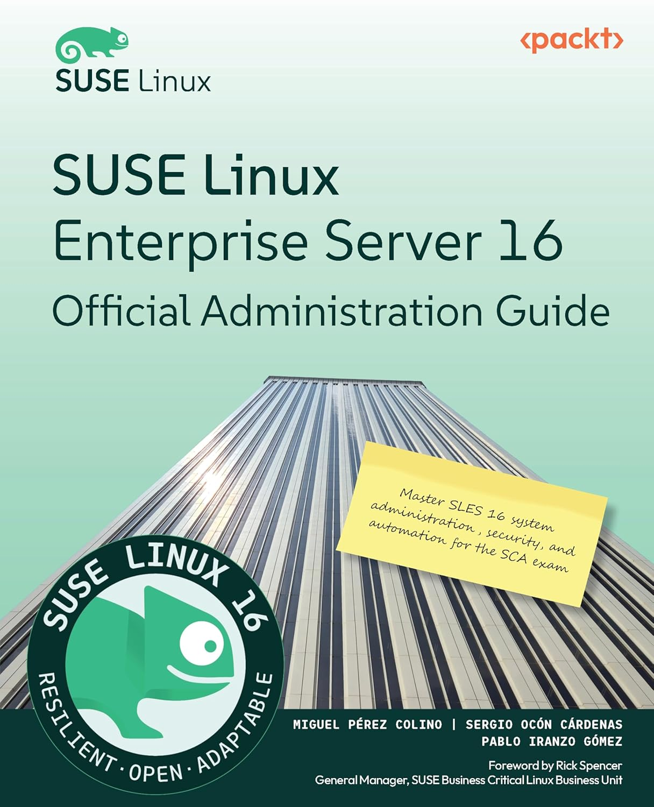

There is a specific kind of magic in the open-source world. It’s not just about the code; it’s about the community and the shared mission to make powerful technology accessible to everyone. 

It took us several months, immersed in a project that is very close to my heart. On January 7th 2026 we finally were able to share the result: the **"SUSE Linux Enterprise Server 16 Official Administration Guide."**

### More Than Just a Manual

When we set out to write this book, we didn't want to create another dry, academic reference manual that sits on a shelf gathering dust. We wanted to build a bridge for people coming from other distros, as well as a gate for people entering the Linux world from other corners (Development, Newtorking, Security, Students ...). 

Our goal was to create a "how-to" guide—a collection of practical, hands-on journeys through the different parts of the operating system. The best way to enjoy it is to have your laptop next to the book and follow chapter after chapter. Whether you are a seasoned sysadmin looking for a refresh or a view on SLES, or someone just starting their Linux adventure, we wanted the text to feel like a conversation with a colleague that tells you "this is how I do it but feel free to experiment". We put a lot of care and love into ensuring that complex topics were broken down into actionable steps, showing not just the *what*, but the *how* and the *why*.

### It Takes a Village (or a Great Team)

Writing a book of this scale is never a solo mission. It was a collaborative labor of love, and I was privileged to work with some of the best in the industry:

* **[Sergio Ocón Cárdenas](https://www.linkedin.com/in/sergioocon/):** My fellow co-author. Navigating the depths of SLES 16 with Sergio made the process not only smoother but much more insightful.
* **[Pablo Iranzo Gómez](https://www.linkedin.com/in/iranzo/):** A huge thank you to Pablo, who provided vital content and shared his deep technical expertise to ensure we covered the right ground.
* **[Apramit Bhattacharya](https://www.linkedin.com/in/apramit-bhattacharya-223901235/):** Our editor, who performed the "magic" of making our technical explanations flow beautifully. If the text feels smooth and readable, it’s thanks to Apramit’s keen eye.
* **[Thorsten Kukuk](https://www.linkedin.com/in/thorsten-kukuk/):** Our technical reviewer. Thorsten did a phenomenal job keeping us honest and ensuring every command and configuration was accurate.
* **[Preet Ahuja](https://www.linkedin.com/in/meetarajani/):** Our marketing liaison, who helped us connect this work with the community and ensured the world knew what we were building.
* **[Miguel Pérez Colino](https://www.linkedin.com/in/miguelpc/):** Myself :-D

### Bringing Linux to You

At its core, this book is about empowerment, and the joy of learning technology to make things. We believe that Linux shouldn't be intimidating. By breaking down SLES 16 into digestible, practical modules, we hope to help a new generation of users, and many of seasoned admins that like the "all in a manual" concept, feel at home with the book, and after reading it, also in the terminal.

For the ones that know me, you know how much I value the "human" side of technology. This book is intended to be an extension of that philosophy, a practical step.

### Get Your Copy

The book is now available through major retailers. You can find it here:

* **[Packt Publishing](https://www.packtpub.com/en-es/product/suse-linux-enterprise-server-16-official-administration-guide-9781806021581)**
* **[Amazon](https://www.amazon.com/-/en/Linux-Enterprise-Server-Official-Administration/dp/1806021595/)**

I’ve also shared some initial thoughts and celebrations over on **[LinkedIn](https://www.linkedin.com/feed/update/urn:li:activity:7412553183215902721/)**, where the community conversation is already growing.

Thank you for being part of this journey. I can’t wait to hear how this guide helps you master SLES 16!

— M*
